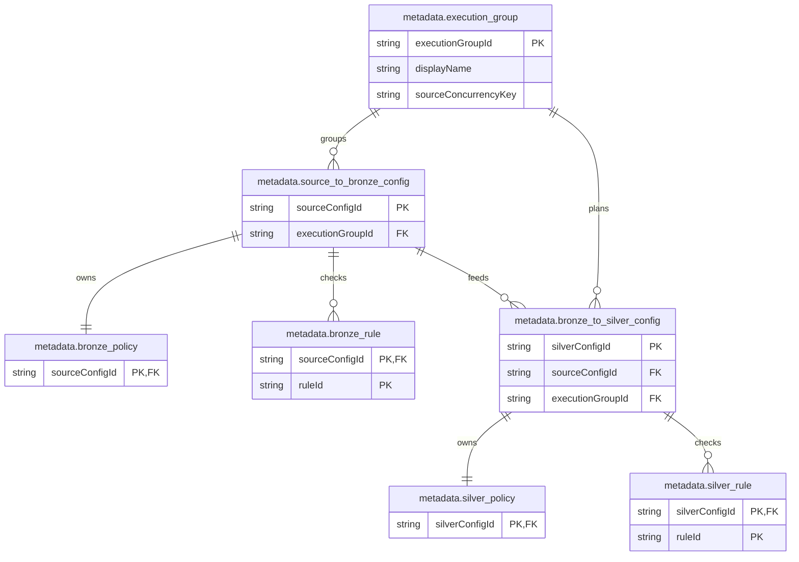
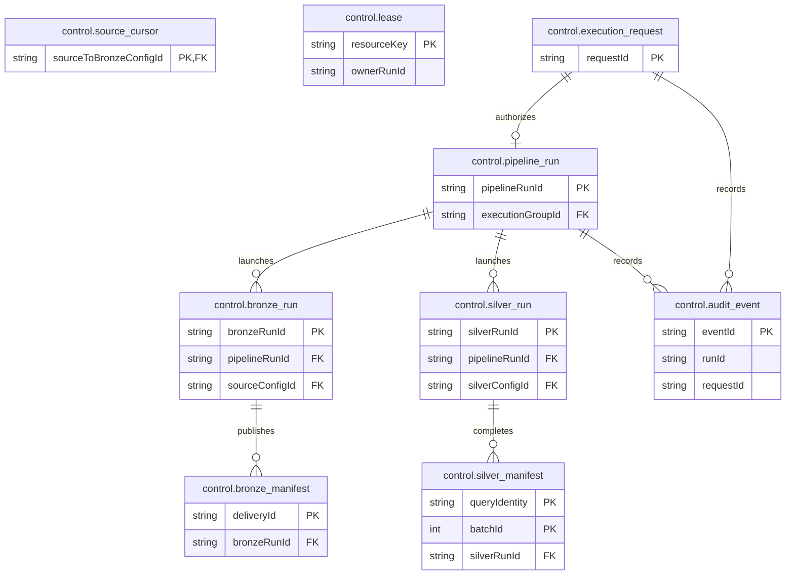

# Control plane

This document defines the logical control-plane contract and its default SQL realization. It names
**16 logical tables: 7 metadata tables and 9 operational tables**. They are not implemented yet;
views, Spark checkpoint files and physical binding storage are outside this named-table count. A company
or domain MAY provide another `ControlPlanePort` adapter, but it MUST preserve these logical
ownership, idempotency, fencing and evidence semantics. Concrete SQL types belong to the default
adapter's migrations.


## Table catalog

All logical control-plane tables are maintained in one catalog. The area column describes lifecycle
and ownership only; it is not a separate table model or a separate document.

| `Area` | Table | Row identity / relationship | Why it exists |
|---|---|---|---|
| `metadata` | metadata.execution_group | Logical group ID referenced by producer/consumer configs | Select future jobs by operational ownership; Fabric owns schedules, triggers and retry envelopes. |
| `metadata` | metadata.source_to_bronze_config | Producer dataset/version; generated configuration PK | Configure one independent Source-to-Bronze chain, including destination and executable reader settings; consumers resolve its retained Bronze relation rather than a producer invocation. |
| `metadata` | metadata.bronze_policy | PK/FK -> Source-to-Bronze config | Store source identity/schema and applicable extraction/publication settings. |
| `metadata` | metadata.bronze_rule | Source-to-Bronze config plus stable rule ID | Store repeated source/Bronze quality and reconciliation checks. |
| `metadata` | metadata.bronze_to_silver_config | Consumer dataset/version; FK to a producer config | Reuse Bronze with separate Silver semantics, targets and stable query checkpoints across versions. |
| `metadata` | metadata.silver_policy | PK/FK -> Bronze-to-Silver config | Store target identity/schema/delete settings and applicable load-strategy settings. |
| `metadata` | metadata.silver_rule | Bronze-to-Silver config plus stable rule ID | Store repeated Silver quality and reconciliation checks independently for each version. |
| `runtime` | control.pipeline_run | Calling Fabric Pipeline/execution-group invocation | Connect planned jobs and evidence to the observable Fabric run. |
| `runtime` | control.bronze_run | One frozen Source-to-Bronze job referencing its config | Preserve resolved settings, boundaries and outcome across metadata edits and retries. |
| `runtime` | control.silver_run | One frozen Bronze-to-Silver invocation referencing its config | Freeze policies/bindings while the query's stable Spark checkpoint outlives individual runs. |
| `runtime` | control.bronze_manifest | Bronze publication/delivery/snapshot evidence | Prove what was published and whether a snapshot is complete; not a consumer scheduling cursor. |
| `runtime` | control.silver_manifest | One logical Silver micro-batch; completing run FK | Record logical batch counts, commits and reconciliation; preserve each execution attempt and count each committed change once. |
| `runtime` | control.source_cursor | Bounded producer config with `checkpoint_ref = NULL` | Persist Source-to-Bronze extraction progress only after proven Bronze publication. |
| `runtime` | control.lease | Resource key and owning worker/run | Fence overlapping query/checkpoint/target mutations and govern shared-provider capacity with compare-and-swap fencing. |
| `runtime` | control.execution_request | One rebuild/recovery request; `operation_type` selects its handler | Share immutable planning, approval, single claim, expiry, retry and terminal evidence across typed operation handlers. |
| `runtime` | control.audit_event | Referenced config/run/request and actor/action | Retain configuration changes, operator/governance actions and retry transitions; reference outcome evidence without duplicating its metrics. |

### Entity relationship diagram

The catalog stays unified; the ER view is split into metadata and runtime diagrams so the
relationships remain readable.

#### Metadata relationships



#### Runtime relationships



## Metadata model

### execution-group

**Purpose:** Groups producer and consumer configurations for normal planning; scope: one logical
execution group and its optional shared provider-capacity key.

**Description:** A group is a future-planning selection boundary, not a Fabric schedule, Pipeline,
checkpoint or execution algorithm.

| Column | Value | Description |
|---|---|---|
| `execution_group_id` | crm_daily | Required stable logical primary key; passed to planning and stored on the parent Pipeline run. |
| `display_name` | CRM daily ingestion | Required operator-facing name; presentation only and safe to edit. |
| `description` | CRM daily ingestion and ownership | Optional operational purpose and ownership notes; never parsed as executable configuration or a source selector. |
| `source_concurrency_key` | crm_provider | Optional logical provider-capacity key shared by groups that must observe one provider limit through bounded leases. |

```text
PRIMARY KEY (execution_group_id)
```

### Source to bronze configuration

**Purpose:** Defines an independent Source-to-Bronze producer contract; scope: one producer
dataset/version, destination relation, reader configuration and optional checkpoint.

**Description:** Silver consumers reference the retained Bronze relation through this configuration;
they do not claim a producer invocation or use its configuration ID as a row filter.

| Column | Value | Description |
|---|---|---|
| `source_to_bronze_config_id` | 101 | Generated immutable primary key and internal owner ID for this producer contract. |
| `dataset_id` | crm_customer | Required logical producer identity within the Workspace. |
| `contract_version` | 1 | Required positive producer-facing retained-fact contract version. |
| `execution_group_id` | crm_daily | Required FK to `metadata.execution_group`; selects this configuration for future normal planning only. |
| `source_profile_description` | CRM / dbo.Customer | Optional descriptive text; never executable source configuration and never contains credentials. |
| `source_reader_ref` | delta_sharing_snapshot@1 | Optional registered reader capability; required for package ingress and `NULL` for native Copy/Dataflow. |
| `source_connection_ref` | connections.crm_share | Optional environment-bound connection reference; required only when the selected reader needs one. |
| `bronze_relation_ref` | bronze.crm_customer_v1 | Required logical relation reference resolved to the append-published Bronze relation. |
| `checkpoint_ref` | checkpoints.crm_customer | Required for `STRUCTURED_STREAMING` readers and `NULL` for `BOUNDED` producers; stable across runs and deleted only after permanent decommissioning stops the query and scheduling. |
| `capture_mode` | **WATERMARK** | Bounded incremental extraction using a proven source boundary and cursor. |
|  | **FULL** | Complete source extraction; watermark fields are normally `NULL`. |
|  | **CDC** | Change-feed extraction requiring declared ordering, identity and source fidelity. |
| `bronze_representation` | **EVENT_LOG** | Append-only retained source events or changes. |
|  | **SNAPSHOT** | Complete state for a declared selection; publication requires completeness proof. |
| `is_enabled` | **true** | Configuration may be selected for future normal planning after validation. |
|  | **false** | Excluded from future normal plans; does not cancel active runs or delete history/checkpoints. |

```text
PRIMARY KEY (source_to_bronze_config_id)
FOREIGN KEY (execution_group_id) REFERENCES metadata.execution_group(execution_group_id)
UNIQUE (dataset_id, contract_version)
```

### bronze to silver configuration

**Purpose:** Defines a Silver consumer contract over a retained Bronze relation; scope: one consumer
dataset/version, target relation and stable query checkpoint.

**Description:** One logical Silver dataset can have v1 and v2 rows that share a valid
Source-to-Bronze configuration while retaining independent targets and checkpoints.

| Column | Value | Description |
|---|---|---|
| `bronze_to_silver_config_id` | 201 | Generated immutable primary key and internal owner ID for this consumer contract. |
| `dataset_id` | customer | Required logical Silver dataset identity within the Workspace. |
| `contract_version` | 1 | Required positive consumer-facing Silver contract version. |
| `execution_group_id` | crm_silver_daily | Required FK to `metadata.execution_group`; selects this configuration for future normal planning. |
| `source_to_bronze_config_id` | 101 | Required FK to the producer contract whose resolved Bronze relation this Silver version consumes. |
| `silver_relation_ref` | silver.customer_v1 | Required logical relation reference resolved to the consumer target relation. |
| `checkpoint_ref` | checkpoints.customer_silver_v1 | Required stable path unique per environment and query contract; independent across versions and deleted only after permanent decommissioning stops the query and scheduling. |
| `load_strategy` | **APPEND** | Adds accepted events while enforcing the strategy's identity and replay rules. |
|  | **SCD1** | Applies deterministic current-state updates for identified entities. |
|  | **SCD2** | Maintains ordered historical entity versions and effective intervals. |
|  | **REPLACE** | Publishes a validated replacement target from a complete candidate input. |
| `is_enabled` | **true** | Configuration may be selected for future normal planning after validation. |
|  | **false** | Excluded from future normal plans; does not cancel active runs or delete history/checkpoints. |

```text
PRIMARY KEY (bronze_to_silver_config_id)
FOREIGN KEY (execution_group_id) REFERENCES metadata.execution_group(execution_group_id)
FOREIGN KEY (source_to_bronze_config_id) REFERENCES metadata.source_to_bronze_config(source_to_bronze_config_id)
UNIQUE (dataset_id, contract_version)
```
### Bronze policy

**Purpose:** Declares source identity, schema, capture, boundary and publication policy; scope: one
Source-to-Bronze configuration.

**Description:** Its typed fields select certified source and publication capabilities; irrelevant
or missing fields for the chosen capture pattern fail planning.

| Column | Value | Description |
|---|---|---|
| `source_to_bronze_config_id` | 101 | Required PK/FK to the producer configuration that owns this policy. |
| `policy_schema_version` | 1 | Required positive version of the policy-field contract, independent of dataset contract version. |
| `source_object_ref` | crm.dbo.Customer | Optional logical reader table or endpoint; `NULL` when Fabric Copy owns physical source selection. |
| `source_fidelity` | **OBSERVATIONS** | Reader exposes observed source facts without a complete-state or change-feed guarantee. |
|  | **COMPLETE_STATE** | Reader exposes complete state for the declared source selection. |
|  | **ALL_CHANGES** | Reader exposes the declared source change history. |
|  | **IMMUTABLE_EVENTS** | Reader exposes immutable, independently identifiable events. |
| `record_identity_columns` | ["delivery_id", "customer_id"] | Required retained-record identity list used for replay and conflict checks. |
| `ordering_columns` | ["lsn", "event_id"] | Required source-position and tie-breaker list for deterministic ordering. |
| `source_operation_column` | operation | Optional retained source-action column; required when source operations are declared facts. |
| `source_boundary_ref` | frozen_watermark_upper@1 | Optional registered capability that selects and proves an extraction upper boundary. |
| `bootstrap_ref` | full_then_watermark@1 | Optional registered baseline/handoff capability; required for an initial baseline before incremental capture. |
| `content_hash_ref` | canonical_sha256@1 | Optional canonical comparison capability; required when content equality or conflict detection is selected. |
| `content_columns` | ["customer_id", "name", "modified_at"] | Optional compared business columns; excludes technical delivery columns. |
| `schema_ref` | schemas.crm_customer@1 | Required expected source-schema identity. |
| `schema_columns` | [{"name":"customer_id","type":"long","nullable":false}] | Required typed schema used to validate the resolved reader schema. |
| `schema_mode` | **STRICT** | Only the declared schema shape is accepted. |
|  | **ADDITIVE_NULLABLE** | Declared columns remain compatible and additional nullable source columns are accepted. |
| `watermark_column` | modified_at | Optional increment-predicate column; required for a temporal `WATERMARK` capability. |
| `watermark_tie_breaker_columns` | ["change_id"] | Optional composite-cursor tie breakers; required when the watermark column is not unique. |
| `watermark_timezone` | UTC | Optional timezone for temporal boundaries; `NULL` for sequence or non-temporal cursors. |
| `watermark_lookback_seconds` | 7200 | Required non-negative temporal overlap; `0` does not move the committed cursor backwards. |
| `snapshot_identity_column` | capture_id | Optional delivery identity; required when a snapshot uses a source or provider token. |
| `snapshot_scope_columns` | ["region"] | Optional snapshot-scope keys; `[]` means the complete selection has one scope. |
| `snapshot_completeness_ref` | provider_snapshot_token@1 | Optional registered completeness-proof capability; required before `SNAPSHOT` publication completes. |
| `reader_options_schema_ref` | options.api_paging@1 | Optional versioned schema defining permitted connector-option names and types. |
| `reader_options` | {"page_size": 1000} | Optional validated bounded connector options; never credentials or executable code. |

```text
PRIMARY KEY (source_to_bronze_config_id)
FOREIGN KEY (source_to_bronze_config_id) REFERENCES metadata.source_to_bronze_config(source_to_bronze_config_id)
```

### Silver policy

**Purpose:** Declares target schema, mutation, delete, history and snapshot-consumption policy;
scope: one Bronze-to-Silver configuration.

**Description:** Common identity, ordering, schema and delete settings serve several strategies;
SCD2 and snapshot publication use conditional fields instead of separate policy tables.

| Column | Value | Description |
|---|---|---|
| `bronze_to_silver_config_id` | 201 | Required PK/FK to the consumer configuration that owns this policy. |
| `policy_schema_version` | 1 | Required positive version of the policy-field contract, independent of dataset contract version. |
| `entity_key_columns` | ["customer_id"] | Optional ordered entity keys; required for keyed strategies such as `UPSERT`, `SCD1` and `SCD2`. |
| `event_identity_columns` | ["event_id"] | Optional APPEND event identity; required for append conflict and replay protection. |
| `ordering_columns` | ["source_version", "event_id"] | Required deterministic winner and ordering columns, including all tie breakers. |
| `content_hash_ref` | canonical_sha256@1 | Optional canonical comparison capability; required when change detection compares content. |
| `content_columns` | ["customer_id", "name"] | Optional business columns included in content equality. |
| `schema_ref` | schemas.customer@1 | Required expected Silver-schema identity for the consumer-facing contract. |
| `schema_columns` | [{"name":"customer_id","type":"long","nullable":false}] | Required typed schema used to validate projected target data. |
| `schema_mode` | **STRICT** | Only the declared target schema shape is accepted. |
| `source_operation_column` | operation | Optional supplied input action column. |
| `delete_operation_values` | ["D"] | Optional typed source action values interpreted as deletes by the registered capability. |
| `delete_marker_column` | is_deleted | Optional input marker used when a boolean or status represents deletion. |
| `delete_marker_values` | [true] | Optional typed marker values; values are not parsed from text. |
| `delete_action` | IGNORE | Declared delete facts do not mutate the target. |
|  | HARD_DELETE | Declared delete facts remove matching target entities. |
|  | SCD2_CLOSE | Declared delete facts close the active SCD2 interval. |
| `effective_time_column` | effective_at | Optional history time; required for strategies that maintain effective intervals. |
| `tracked_columns` | ["name", "status"] | Optional change-tracked columns that create a new history version. |
| `late_arrival_policy` | REJECT_AND_REBUILD | Late data is rejected and requires a governed rebuild to correct history. |
|  | CORRECT_WITHIN_WINDOW | Late data may correct history within `correction_window_seconds`. |
| `correction_window_seconds` | 604800 | Required non-negative correction window for `CORRECT_WITHIN_WINDOW`; otherwise `NULL`. |
| `snapshot_selection_ref` | latest_complete_snapshot@1 | Optional complete-snapshot selection capability; required for snapshot-diff consumers. |
| `snapshot_diff_apply_ref` | snapshot_diff_to_scd1@1 | Optional capability that converts snapshot differences to mutations. |
| `replace_publication_ref` | validated_stable_target@1 | Optional certified candidate-cutover capability; required for `REPLACE` publication. |

```text
PRIMARY KEY (bronze_to_silver_config_id)
FOREIGN KEY (bronze_to_silver_config_id) REFERENCES metadata.bronze_to_silver_config(bronze_to_silver_config_id)
```

Delete values are typed arrays, not text that the executor guesses how to interpret. When using
both operation and marker evidence, the capability MUST declare precedence/conflict behavior.
Setting HARD_DELETE without supported delete facts MUST fail planning. Source operation columns in
the two stage policies may name the same field, but only Silver declares target delete behavior.

`ordering_columns` includes all required tie breakers; `effective_time_column` retains its distinct
history-interval role even when it is also an ordering column. Snapshot selection capabilities MUST
use complete, comparable declared scopes. REPLACE publication guards and APPEND conflict/replay
behavior remain those of the selected certified strategy.

### Bronze rules

**Purpose:** Registers producer-side quality and reconciliation checks; scope: one
Source-to-Bronze configuration and its stable rule IDs.

**Description:** Checks use child rows rather than a growing set of columns or a JSON document.
Bronze and Silver rules have separate owning foreign keys, so no row couples Silver versions.

| Column | Value | Description |
|---|---|---|
| `source_to_bronze_config_id` | 101 | Required FK to the producer configuration that owns this rule. |
| `rule_id` | copied_count_matches_source | Required stable local rule ID, unique within its owning configuration. |
| `rule_kind` | **QUALITY** | Validates data facts. |
|  | **RECONCILIATION** | Compares bounded source and publication evidence. |
| `rule_ref` | row_count_matches@1 | Required registered check capability and version. |
| `rule_order` | 10 | Required non-negative order within the registered execution phase. |
| `column_names` | ["customer_id"] | Optional validated input columns; use `[]` when the check consumes only aggregate or reference metrics. |
| `reference_relation_ref` | bronze.customer_baseline | Optional declared comparison relation; required when the rule compares against a relation. |
| `reference_metric_ref` | source.selected_rows | Optional bounded evidence metric; required when the rule compares a recorded metric. |
| `comparison` | **EQ** | Equal-to comparison for threshold-based checks. |
|  | **GE** | Greater-than-or-equal comparison for threshold-based checks. |
|  | **LE** | Less-than-or-equal comparison for threshold-based checks. |
| `threshold` | 0 | Optional numeric threshold interpreted only by the registered rule capability. |
| `failure_action` | **FAIL** | Stops the governed operation when the rule fails. |
|  | **REPORT** | Records the failure without stopping when the rule contract permits it. |


Each check's registry contract defines its execution phase, required fields, valid comparator,
evidence inputs and permitted failure action. Rules run over Spark/Delta and return bounded metrics
and evidence references. No rule contains arbitrary Python, a domain callback or unrestricted SQL.
Selected columns/references MUST exist and be declared in the frozen plan. Irrelevant or missing
fields fail validation. Checks requiring unsupported additional parameters fail planning until the
typed model and certified capability support them; do not add arbitrary parameter bags as a workaround.

Bronze validation MUST NOT silently discard source facts and still declare a complete snapshot.
Silver QUARANTINE is for supported row-level quality checks, not a way to ignore failed final
reconciliation. Required completeness, replay/conflict and strategy invariants cannot be changed to
REPORT or omitted by removing optional rule rows.

### Silver rules

**Purpose:** Registers consumer-side quality and reconciliation checks; scope: one
Bronze-to-Silver configuration and its stable rule IDs.

**Description:** The consumer owns these checks independently of other Silver versions, even when
they consume the same Source-to-Bronze configuration.

| Column | Value | Description |
|---|---|---|
| `bronze_to_silver_config_id` | 201 | Required FK to the consumer configuration that owns this rule. |
| `rule_id` | customer_key_not_null | Required stable local rule ID, unique within its owning configuration. |
| `rule_kind` | **QUALITY** | Validates Silver data. |
|  | **RECONCILIATION** | Compares bounded target and input evidence. |
| `rule_ref` | not_null@1 | Required registered check capability and version. |
| `rule_order` | 10 | Required non-negative order within the registered execution phase. |
| `column_names` | ["customer_id"] | Optional validated input columns; required when the check operates on named columns. |
| `reference_relation_ref` | silver.customer_previous | Optional declared comparison relation; required when the rule compares against a relation. |
| `reference_metric_ref` | batch.accepted_rows | Optional bounded evidence metric; required when the rule compares a recorded metric. |
| `comparison` | **EQ**, **GE** or **LE** | Optional typed comparator required by threshold-based checks. |
| `threshold` | 0 | Optional numeric threshold interpreted only by the registered rule capability. |
| `failure_action` | **FAIL** | Stops the governed operation when the rule fails. |
|  | **REPORT** | Records the failure without stopping when the rule contract permits it. |
|  | **QUARANTINE** | Diverts failing rows only for supported row-level quality checks. |

```text
PRIMARY KEY (bronze_to_silver_config_id, rule_id)
FOREIGN KEY (bronze_to_silver_config_id) REFERENCES metadata.bronze_to_silver_config(bronze_to_silver_config_id)
```


One Source-to-Bronze configuration is reusable by zero or more Bronze-to-Silver consumers. The
consumer row owns its own Silver policy and rules, while its
`source_to_bronze_config_id` points back to the shared producer:

```text
source_to_bronze_config 101
├── bronze_policy 101
├── bronze_rule (101, rule_id), zero or more
├── bronze_to_silver_config 201
│   ├── silver_policy 201
│   └── silver_rule (201, rule_id), zero or more
└── bronze_to_silver_config 202
    ├── silver_policy 202
    └── silver_rule (202, rule_id), zero or more
```

Both consumer rows contain `source_to_bronze_config_id = 101`. The Silver policy and rule tables do
not repeat that producer ID: their owner is the `bronze_to_silver_config_id`, whose row already
links to the producer. Therefore the Silver rule identity is
`(bronze_to_silver_config_id, rule_id)`, not `(source_to_bronze_config_id, rule_id)`. A Silver plan
still resolves both sides and carries the consumer config/policy plus the producer config/policy.


## Runtime table contracts

Runtime rows use opaque IDs and references. They record plans, lifecycle, bounded evidence and
coordination state; business rows, Spark offsets, Spark state and detailed row-level diagnostics stay
in their authoritative Spark/Delta locations. The logical shapes below define the fields and
relationships required by the default control plane.

### pipeline run

**Purpose:** Tracks one planned control-plane and Fabric invocation through its lifecycle; scope:
one execution-group run.

**Description:** It is the parent record that correlates a requested group, frozen plan, Fabric run
and bounded outcome evidence.

| Column | Value | Description |
|---|---|---|
| `pipeline_run_id` | run_01 | Required immutable primary key for one planning and invocation lifecycle. |
| `execution_group_id` | crm_daily | Required FK to the requested execution group. |
| `environment_ref` | prod | Required deployment environment and Workspace-bound runtime scope. |
| `fabric_pipeline_run_id` | fabric_123 | Optional external Fabric Pipeline run identity for monitoring correlation. |
| `execution_request_id` | request_01 | Optional FK to the approved one-time operation that caused this invocation. |
| `plan_hash` | sha256:... | Required frozen identity of selected configs, policies, rules and bindings. |
| `status` | **PLANNED** | Frozen plan exists; Pipeline work has not started. |
|  | **RUNNING** | Pipeline execution has started. |
|  | **SUCCEEDED** | Required work and outcome evidence completed. |
|  | **FAILED** | Execution ended with bounded failure evidence. |
|  | **CANCELLED** | Execution was deliberately stopped. |
| `requested_at` | 2026-09-18T10:00:00Z | Required planning acceptance time. |
| `started_at` | 2026-09-18T10:01:00Z | Optional execution start time; `NULL` before work begins. |
| `completed_at` | 2026-09-18T10:10:00Z | Required for terminal statuses and `NULL` while active. |
| `error_code` | SOURCE_UNAVAILABLE | Optional bounded terminal failure category; never a stack trace. |
| `evidence_ref` | evidence://run_01 | Optional bounded reference to detailed diagnostics. |

```text
PRIMARY KEY (pipeline_run_id)
FOREIGN KEY (execution_group_id) REFERENCES metadata.execution_group(execution_group_id)
FOREIGN KEY (execution_request_id) REFERENCES control.execution_request(execution_request_id)
```

### bronze run

**Purpose:** Records one frozen Source-to-Bronze execution attempt; scope: one producer
configuration and parent pipeline run.

**Description:** Retries create new attempt rows, preserving the resolved producer configuration,
source boundary and execution mode that governed each attempt.

| Column | Value | Description |
|---|---|---|
| `bronze_run_id` | bronze_run_01 | Required immutable primary key passed to the Source-to-Bronze runner. |
| `pipeline_run_id` | run_01 | Required FK to the parent group invocation. |
| `source_to_bronze_config_id` | 101 | Required FK to the producer configuration frozen for this run. |
| `execution_request_id` | request_01 | Optional FK to an approved one-time operation. |
| `attempt_number` | 2 | Required positive producer attempt number; retries create a new row. |
| `source_execution_mode` | **BOUNDED** | Reads a bounded source; `checkpoint_ref` is `NULL`. |
|  | **STRUCTURED_STREAMING** | Runs a streaming reader; `checkpoint_ref` is required. |
| `bronze_relation_ref` | bronze.crm_customer_v1 | Required frozen Bronze target relation. |
| `checkpoint_ref` | checkpoints.crm_customer | Optional frozen producer checkpoint; required only for `STRUCTURED_STREAMING`. |
| `source_boundary_ref` | boundary://crm/42 | Optional frozen source boundary required by bounded capture capabilities. |
| `plan_hash` | sha256:... | Required frozen producer-plan identity. |
| `status` | **PLANNED** | Frozen plan exists; execution has not started. |
|  | **RUNNING** | Runner has claimed and started the job. |
|  | **SUCCEEDED** | Required publication and evidence completed. |
|  | **FAILED** | Execution ended with bounded failure evidence. |
|  | **CANCELLED** | Execution was deliberately stopped. |
| `started_at` | 2026-09-18T10:01:00Z | Optional start time; `NULL` until claimed. |
| `completed_at` | 2026-09-18T10:10:00Z | Required for terminal statuses and `NULL` while active. |
| `error_code` | SOURCE_UNAVAILABLE | Optional bounded failed-stage category. |
| `evidence_ref` | evidence://bronze_run_01 | Optional reference to Bronze manifest or detailed Delta evidence. |

```text
PRIMARY KEY (bronze_run_id)
FOREIGN KEY (pipeline_run_id) REFERENCES control.pipeline_run(pipeline_run_id)
FOREIGN KEY (source_to_bronze_config_id) REFERENCES metadata.source_to_bronze_config(source_to_bronze_config_id)
FOREIGN KEY (execution_request_id) REFERENCES control.execution_request(execution_request_id)
```
### Silver Run

**Purpose:** Records one frozen Silver query execution attempt; scope: one consumer configuration,
checkpoint contract and parent pipeline run.

**Description:** Each retry creates a new run row while retaining the consumer contract's stable
`query_identity` and `checkpoint_ref`. This table records the attempt lifecycle and frozen plan;
`control.silver_manifest` records the idempotent effects and completion evidence for its
micro-batches.

| Column | Value | Description |
|---|---|---|
| `silver_run_id` | silver_run_01 | Required immutable primary key passed to the Silver Spark runner. |
| `pipeline_run_id` | run_01 | Required FK to the parent group invocation. |
| `bronze_to_silver_config_id` | 201 | Required FK to the consumer configuration frozen for this run. |
| `source_to_bronze_config_id` | 101 | Required FK to the resolved producer retained for evidence and diagnosis. |
| `execution_request_id` | request_01 | Optional FK to an approved one-time operation. |
| `attempt_number` | 2 | Required positive query attempt number; retries create new run rows. |
| `query_identity` | customer_v1_generation_1 | Required stable checkpoint-generation identity; changes only for an explicit fresh checkpoint or bootstrap plan. |
| `silver_relation_ref` | silver.customer_v1 | Required frozen Silver target relation. |
| `checkpoint_ref` | checkpoints.customer_silver_v1 | Required frozen checkpoint owned by the consumer contract, never mutable SQL progress. |
| `plan_hash` | sha256:... | Required frozen consumer-plan identity. |
| `status` | **PLANNED** | Frozen plan exists; execution has not started. |
|  | **RUNNING** | Runner has claimed and started the query. |
|  | **SUCCEEDED** | Required processing and evidence completed. |
|  | **FAILED** | Execution ended with bounded failure evidence. |
|  | **CANCELLED** | Execution was deliberately stopped. |
| `started_at` | 2026-09-18T10:01:00Z | Optional start time; `NULL` until the runner claims the query. |
| `completed_at` | 2026-09-18T10:10:00Z | Required for terminal statuses and `NULL` while active. |
| `error_code` | TARGET_WRITE_FAILED | Optional bounded failed-stage category. |
| `evidence_ref` | evidence://silver_run_01 | Optional reference to Silver manifests or detailed Delta evidence. |

```text
PRIMARY KEY (silver_run_id)
FOREIGN KEY (pipeline_run_id) REFERENCES control.pipeline_run(pipeline_run_id)
FOREIGN KEY (bronze_to_silver_config_id) REFERENCES metadata.bronze_to_silver_config(bronze_to_silver_config_id)
FOREIGN KEY (source_to_bronze_config_id) REFERENCES metadata.source_to_bronze_config(source_to_bronze_config_id)
FOREIGN KEY (execution_request_id) REFERENCES control.execution_request(execution_request_id)
```


### Bronze manifests

**Purpose:** Preserves bounded Bronze publication and snapshot-completeness evidence; scope: one
delivery or complete snapshot publication.

**Description:** The manifest contains bounded metadata only:

- Source-to-Bronze configuration, Bronze/provider run and delivery/snapshot identities;
- completion state;
- landed relation, Delta version, partition or immutable file references;
- frozen source boundary and Bronze representation;
- source schema/contract identity;
- available bounded source/copied/rejected counts; and
- completion time and evidence references.

A provider activity marked successful is insufficient to prove snapshot completeness. The
registered snapshot publication/consumption capability MUST validate its manifest and must handle
publication recovery and snapshots spanning multiple micro-batches. Append-log readers consume
published Delta commits without a per-capture SQL claim.

| Column | Value | Description |
|---|---|---|
| `delivery_id` | delivery_01 | Required immutable primary key for one Bronze delivery or complete snapshot publication. |
| `bronze_run_id` | bronze_run_01 | Required FK to the producer execution that published or attempted this delivery. |
| `source_to_bronze_config_id` | 101 | Required FK to the producer contract that owns the delivery. |
| `bronze_relation_ref` | bronze.crm_customer_v1 | Required relation containing the published delivery. |
| `completion_state` | **PENDING** | Publication exists but completion has not been proven. |
|  | **COMPLETE** | Selected completeness proof and required publication evidence are present. |
|  | **FAILED** | Publication attempt ended without completing the delivery. |
| `delta_version` | 42 | Optional published Delta version for the delivery commit. |
| `source_boundary_ref` | boundary://crm/42 | Optional frozen source interval or snapshot boundary. |
| `snapshot_identity_ref` | snapshot://crm/2026-09-18 | Optional provider or source snapshot identity; required when completeness depends on an external token. |
| `selected_rows` | 1000 | Optional bounded source-selection count. |
| `published_rows` | 998 | Optional bounded Bronze-publication count. |
| `rejected_rows` | 2 | Optional bounded rejected-row count. |
| `evidence_ref` | evidence://delivery_01 | Optional bounded publication or completeness evidence reference. |
| `completed_at` | 2026-09-18T10:10:00Z | Required when `completion_state` is `COMPLETE`. |

```text
PRIMARY KEY (delivery_id)
FOREIGN KEY (bronze_run_id) REFERENCES control.bronze_run(bronze_run_id)
FOREIGN KEY (source_to_bronze_config_id) REFERENCES metadata.source_to_bronze_config(source_to_bronze_config_id)
```

### Silver manifests

**Purpose:** Records Silver micro-batch effects, reconciliation and completion evidence; scope: one
query identity and micro-batch ID.

**Description:** Each row is the idempotent logical record for `(query_identity, batch_id)`, even when a batch is
retried. `COMMITTED` proves the target mutation effects; `COMPLETE` additionally proves all
required reconciliation and completion evidence.

| Column | Value | Description |
|---|---|---|
| `query_identity` | customer_v1_generation_1 | Required stable checkpoint-generation identity for one Silver query contract in the environment. |
| `batch_id` | 42 | Required non-negative Spark micro-batch ID, unique with `query_identity`. |
| `silver_run_id` | silver_run_01 | Optional FK to the completing run; `NULL` until the batch is `COMPLETE`. |
| `input_rows` | 1000 | Optional bounded count observed by the batch. |
| `accepted_rows` | 995 | Optional bounded count admitted to the mutation path. |
| `quarantined_rows` | 5 | Optional bounded count diverted by supported row-level quality handling. |
| `inserted_rows` | 700 | Optional target insertion operations, not distinct business entities. |
| `updated_rows` | 295 | Optional target update operations, not distinct business entities. |
| `deleted_rows` | 0 | Optional target deletion operations, not distinct business entities. |
| `target_commit_ref` | delta://silver/customer#42 | Optional committed-operation evidence; required before `COMPLETE` when a target mutation occurred. |
| `reconciliation_ref` | evidence://reconciliation/42 | Optional persisted reconciliation evidence; required before `COMPLETE` when reconciliation is selected. |
| `completion_state` | **PENDING** | Logical batch identity exists; effects are not yet proven. |
|  | **COMMITTED** | Target mutation effects are proven. |
|  | **COMPLETE** | Required reconciliation and completion evidence are proven. |
| `completed_at` | 2026-09-18T10:10:00Z | Required only when `completion_state` is `COMPLETE`. |

```text
PRIMARY KEY (query_identity, batch_id)
FOREIGN KEY (silver_run_id) REFERENCES control.silver_run(silver_run_id)
```

### Source Cursor

**Purpose:** Persists bounded Source-to-Bronze extraction progress after proven publication; scope:
one bounded producer configuration.

**Description:** It advances only after the related Bronze delivery is complete and is never the
progress store for a Structured Streaming checkpoint.

| Column | Value | Description |
|---|---|---|
| `source_to_bronze_config_id` | 101 | Required PK/FK to a bounded producer configuration whose `checkpoint_ref` is `NULL`. |
| `cursor_schema_ref` | cursor.watermark_pair@1 | Required versioned schema defining how `cursor_payload` is decoded. |
| `cursor_payload` | {"watermark":"2026-09-18T00:00:00Z","tie_breaker":42} | Optional serialized bounded source position; `NULL` before first proven publication or when uninitialized. |
| `source_boundary_ref` | boundary://crm/42 | Optional last proven source boundary; updated only after the related Bronze delivery is complete. |
| `last_delivery_id` | delivery_01 | Optional FK to the publication that justified the current cursor. |
| `last_bronze_delta_version` | 42 | Optional published Bronze Delta version associated with cursor advancement. |
| `row_version` | 7 | Required optimistic-concurrency value for compare-and-swap cursor advancement. |
| `updated_at` | 2026-09-18T10:10:00Z | Required time of last successful cursor advance; never Spark streaming progress. |

```text
PRIMARY KEY (source_to_bronze_config_id)
FOREIGN KEY (source_to_bronze_config_id) REFERENCES metadata.source_to_bronze_config(source_to_bronze_config_id)
FOREIGN KEY (last_delivery_id) REFERENCES control.bronze_manifest(delivery_id)
```
### Lease

**Purpose:** Fences ownership of mutable resources and shared provider capacity; scope: one
canonical resource key.

**Description:** Only the current ACTIVE holder with its fencing token may mutate the resource;
workers stop when renewal or ownership validation fails.

| Column | Value | Description |
|---|---|---|
| `resource_key` | checkpoint:customer_v1 | Required immutable primary key for a query, target relation, checkpoint or provider-capacity resource. |
| `lease_id` | lease_01 | Required current ownership identity; changes when ownership is reacquired after release or expiry. |
| `owner_run_id` | silver_run_01 | Required run or request identity authorized to mutate the resource. |
| `owner_id` | worker_01 | Required executor identity holding the lease. |
| `fencing_token` | 42 | Required monotonic or unique value presented with every protected mutation. |
| `state` | **ACTIVE** | Current owner may mutate the resource with the matching fencing token. |
|  | **RELEASED** | Ownership ended intentionally; no owner may mutate until a new lease is acquired. |
|  | **EXPIRED** | Ownership elapsed without valid renewal; the former worker must stop mutating. |
| `acquired_at` | 2026-09-18T10:00:00Z | Required start time of the current ownership interval. |
| `renewed_at` | 2026-09-18T10:05:00Z | Optional last successful renewal time; `NULL` before first renewal. |
| `expires_at` | 2026-09-18T10:10:00Z | Required expiry time; workers stop when renewal or ownership validation fails. |
| `row_version` | 7 | Required optimistic-concurrency value for acquire, renew and release. |

```text
PRIMARY KEY (resource_key)
```
### execution request

**Purpose:** Governs one approved, claimable and terminal one-time operation; scope: one rebuild or
recovery request.

**Description:** The request freezes typed operation parameters and authorization evidence; it is
not durable dataset configuration and an approved request can be claimed only once.

| Column | Value | Description |
|---|---|---|
| `execution_request_id` | request_01 | Required immutable primary key supplied to a governed one-time operation. |
| `operation_type` | REBUILD | Required registered operation handler that selects typed validation and execution behavior. |
| `target_config_ref` | silver.customer:1 | Required logical producer or consumer configuration being operated on. |
| `target_dataset_id` | customer | Required logical dataset identity retained for review and evidence. |
| `contract_version` | 1 | Required positive target contract version. |
| `environment_ref` | prod | Required environment; the request cannot execute in another Workspace environment. |
| `plan_ref` | plan://request_01 | Required frozen operation plan containing approved typed parameters, source boundary and selection. |
| `artifact_ref` | framework@0.1.0 | Required approved framework or domain artifact identity. |
| `configuration_hash` | sha256:... | Required selected metadata and configuration hash; detects changes after approval. |
| `binding_hash` | sha256:... | Required resolved environment-binding hash; detects topology or connection changes after approval. |
| `requested_by` | operator@example.com | Required identity of the request creator. |
| `requested_at` | 2026-09-18T10:00:00Z | Required request creation time that starts its lifecycle. |
| `approved_by` | approver@example.com | Optional approver identity; required before `APPROVED` can transition to `CLAIMED`. |
| `approved_at` | 2026-09-18T10:05:00Z | Optional approval time; `NULL` until a decision is recorded. |
| `reason_ref` | INC-12345 | Required bounded reason or ticket reference. |
| `expires_at` | 2026-09-19T10:00:00Z | Required request or approval expiry time; expired requests cannot be claimed. |
| `status` | **PLANNED** | Typed plan is frozen but not yet approved. |
|  | **APPROVED** | Governed approval is recorded and the request is eligible for a single claim. |
|  | **CLAIMED** | One production worker or Pipeline has atomically claimed the request. |
|  | **RUNNING** | The claimed operation is executing. |
|  | **SUCCEEDED** | The operation completed successfully with terminal evidence. |
|  | **FAILED** | The operation ended unsuccessfully with terminal evidence. |
|  | **CANCELLED** | The operation was intentionally stopped. |
|  | **REJECTED** | Approval was denied. |
|  | **EXPIRED** | The request or approval expired before a valid claim completed. |
| `claimed_by` | fabric_pipeline_01 | Optional worker or Pipeline identity set atomically on claim. |
| `claimed_at` | 2026-09-18T10:06:00Z | Optional claim time; `NULL` before `CLAIMED`. |
| `completed_at` | 2026-09-18T10:20:00Z | Required for terminal statuses. |
| `outcome_ref` | evidence://request_01 | Optional bounded reference to resulting run or evidence records. |

```text
PRIMARY KEY (execution_request_id)
```
### audit event

**Purpose:** Retains immutable configuration, governance, lifecycle and outcome transitions; scope:
one recorded event and its related entities.

**Description:** It correlates actors and related configuration, run or request identities while
referencing detailed evidence instead of duplicating unbounded diagnostics or business metrics.

| Column | Value | Description |
|---|---|---|
| `event_id` | event_01 | Required immutable primary key and physical correlation key for idempotent event recording. |
| `event_type` | CONFIGURATION_CHANGED | Required registered event type; identifies a configuration, planning, lease, callback, approval or outcome transition. |
| `actor_id` | worker_01 | Required actor or service identity that caused or reported the event. |
| `occurred_at` | 2026-09-18T10:10:00Z | Required event time supplied by the recording boundary. |
| `config_ref` | source.crm_customer:1 | Optional producer or consumer configuration for a metadata-scoped event. |
| `run_id` | run_01 | Optional generic run identity when a specific run column is not used. |
| `pipeline_run_id` | run_01 | Optional FK to the parent pipeline invocation. |
| `bronze_run_id` | bronze_run_01 | Optional FK to the associated producer execution. |
| `silver_run_id` | silver_run_01 | Optional FK to the associated consumer execution. |
| `execution_request_id` | request_01 | Optional FK to the associated governed request. |
| `attempt_id` | attempt_01 | Optional stable callback-attempt identity shared by its started and terminal events. |
| `query_identity` | customer_v1_generation_1 | Optional Silver checkpoint-generation identity; required for batch or callback events. |
| `batch_id` | 42 | Optional Spark micro-batch ID; required with `query_identity` for batch or callback events. |
| `owner_id` | worker_01 | Optional lease or fencing owner that held execution ownership. |
| `fencing_token` | 42 | Optional ownership proof used by a protected transition. |
| `target_commit_ref` | delta://silver/customer#42 | Optional target Delta commit evidence; identifies a mutation without duplicating metrics. |
| `error_code` | TARGET_WRITE_FAILED | Optional bounded error category; detailed stack traces remain in execution evidence. |
| `evidence_ref` | evidence://event_01 | Optional bounded diagnostics, reconciliation or outcome evidence reference. |

```text
PRIMARY KEY (event_id)
FOREIGN KEY (pipeline_run_id) REFERENCES control.pipeline_run(pipeline_run_id)
FOREIGN KEY (bronze_run_id) REFERENCES control.bronze_run(bronze_run_id)
FOREIGN KEY (silver_run_id) REFERENCES control.silver_run(silver_run_id)
FOREIGN KEY (execution_request_id) REFERENCES control.execution_request(execution_request_id)
```
## Public procedure interfaces

The default SQL adapter exposes versioned public procedures, not private table writes. Runtime state
is written through the framework control-plane port. The names below describe planned default-SQL
interface families; they are illustrative, not implemented SQL APIs or finalized signatures. A
company/domain adapter exposes equivalent semantic operations through its own transport. Public
inspection views read these tables without mutating them. No procedure implements business-data
algorithms.

| Planned interface / example name | Tables read or changed | Purpose |
|---|---|---|
| metadata.usp_upsert_execution_group | metadata.execution_group | Register the group referenced by producer/consumer configs. |
| metadata.usp_upsert_source_to_bronze_config | Producer config | Idempotently resolve/create its logical dataset/version and attach routing. |
| metadata.usp_upsert_bronze_to_silver_config | Consumer config; reads producer config | Resolve the producer FK and register independent target/checkpoint settings. |
| metadata.usp_upsert_bronze_policy | `metadata.bronze_policy`; reads source config | Resolve the owner and validate common plus extraction/representation settings. |
| metadata.usp_upsert_silver_policy | `metadata.silver_policy`; reads consumer config | Resolve the owner and validate common plus load-strategy settings. |
| metadata.usp_upsert_bronze_rule | `metadata.bronze_rule`; reads source config/policy | Upsert a registered typed check by owner plus stable rule ID. |
| metadata.usp_upsert_silver_rule | `metadata.silver_rule`; reads consumer config/policy | Upsert an independently owned Silver check by owner plus stable rule ID. |
| metadata.usp_set_config_enabled | Selected producer/consumer config | Pause/resume future normal planning per configuration; audit changes without cancelling active runs or deleting resources/checkpoints. |
| control.usp_plan_execution_group | Enabled metadata; creates Pipeline, Bronze and Silver runs | Validate enabled group members, dependency graph, bindings and provider capacity; freeze bounded job plans. |
| control.usp_record_bronze_manifest | `control.bronze_manifest`; reads Bronze run | Publish consistent bounded delivery/completeness evidence. |
| control.usp_advance_source_cursor | `control.source_cursor`; reads publication/lease evidence | Advance a bounded producer's cursor with compare-and-swap after proven publication. |
| Lease acquire/renew/release procedures | `control.lease`; reads owner run/resource scope | Claim/fence queries, targets, checkpoints and provider slots; never modify Spark checkpoint files. |
| control.usp_record_silver_manifest | `control.silver_manifest`, attempt audit events; reads Silver run/query binding | Idempotently record batch effects, reconciliation and completion while preserving attempt history. |
| Run outcome recording procedures | Bronze/Silver runs; reads manifests | Record execution status and expose summaries derived from completed batch evidence. |
| Execution-request planning procedure | `control.execution_request`; reads config/bindings | Validate a registered typed handler and parameters, then freeze a one-time plan as PLANNED; no execution authorization yet. |
| Request approval/rejection procedure | `control.execution_request`, `control.audit_event` | Record the governed approval decision; protected environments require approval before claim. |
| Request claim procedure | Request, lease and production run state | Atomically claim one eligible, unexpired approved request for one production execution. |
| Request completion/cancellation procedure | Request, run and audit state | Record fenced lifecycle transitions and terminal evidence; a successful request is not reusable. |

For example, `control.usp_plan_execution_group(execution_group_id, environment, fabric_pipeline_run_id)`
returns opaque job-run identities. The Pipeline does not join private tables or interpret policies.
See [Annotated SQL](../examples/CONTROL_PLANE_CONFIGURATION.md#annotated-desired-state-sql) for
configuration calls and prerequisite policy setup.
