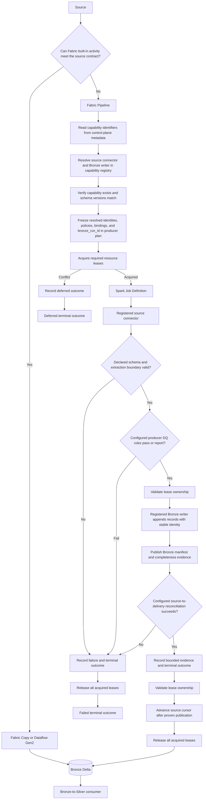

# Source-to-Bronze producer

## Purpose

The Source-to-Bronze producer is the framework Spark runtime for sources that Fabric built-in
activities cannot ingest faithfully. It captures source facts into an append-only Bronze Delta
relation and provides schema governance, data-quality and reconciliation evidence, and operational
traceability without silently losing source data.

Use it when a Fabric built-in activity cannot meet the source contract. For example, a connector
may support only bucket-based incremental loading when the dataset requires a source watermark,
deterministic ordering, delete evidence, or a different extraction boundary. The framework then
uses a registered Spark-native source connector and Bronze writer.

Bronze preserves source data whenever the selected representation can safely retain it. A data
quality rule may report a problem without dropping data, but a rule configured to fail prevents a
successful delivery publication. The canonical contracts for source facts, Bronze representations,
and publication eligibility are in [Source-to-Bronze lifecycle](SOURCE_TO_BRONZE_LIFE_CYCLE.md); this document describes
the pipeline topology.

## Pipeline Flow

## Lease lifecycle

The producer acquires all required leases after it freezes its plan and before it starts a Spark
job or contacts the source. A lease conflict is a deferred run, not a second producer against the
same mutable resource.

| Resource | When to acquire it | Why it is needed |
|---|---|---|
| `cursor:<source_to_bronze_config_id>` | For a bounded producer, before reading its current cursor or source boundary | Prevent two runs from extracting and advancing the same cursor concurrently. |
| `checkpoint:<checkpoint_ref>` | For a streaming producer, before starting its query | Prevent two Spark queries from using one checkpoint. |
| `provider:<key>:slot:<n>` | Only when a source provider has a shared concurrency limit; acquire one available slot before contacting the provider | Limit concurrent source requests across execution groups without serializing unrelated sources. |

The worker renews every active lease while the Spark job runs. It validates its current fencing
token immediately before each protected Bronze publication and before advancing a bounded source
cursor. If renewal or ownership validation fails, the worker stops and records a failed outcome;
it must not make another protected mutation.

On success, the runtime advances the cursor only after publication, records the terminal outcome,
then releases every lease it acquired. On any failure, including connector, schema, DQ,
publication, reconciliation, or cursor-advance failure, it records the failed terminal outcome
and releases every acquired lease in a `finally` path. If the worker crashes before release, the
lease expires; a later run may acquire a new fencing token, and the former worker must not resume
protected work.

## Pipeline script and modular capabilities

A Fabric Notebook or Spark Job Definition for the framework producer is intentionally an explicit, thin launch/composition
surface. It passes the opaque `bronze_run_id` to the public runtime and makes the high-level flow
observable; it does not embed source-to-Bronze business algorithms or query control tables directly.

The runtime composes focused Python classes for source reading, schema validation, Bronze writing,
data quality, reconciliation, and evidence recording. This keeps complex ingestion behavior
modular and testable. When a source requires a specialized connector, DQ check, or reconciliation
method, implement it as a registered, versioned framework capability with Spark/Delta and Fabric
integration tests. The class must operate on Spark DataFrames and return bounded evidence, not
business rows to the driver.

## Execution-group scheduling and table isolation

Planning one execution group creates one frozen `bronze_run_id` for each selected producer
configuration. A Spark Job Definition or thin Fabric Notebook launcher receives the parent
`pipeline_run_id`, then processes every planned table delivery independently. It does not receive
a handwritten table list or query private control-plane tables.

The standard sequential runtime uses an abstract table-delivery executor and audit manager. The
audit manager returns each frozen delivery with its selected ingestion-method reference and ordered
DQ and reconciliation rule references. Immediately before each table runs, a runtime factory
constructs that table's ingestion method, DQ evaluator and reconciliation evaluator from those
frozen references. The executor performs one table's Spark/Delta work and returns bounded DQ and
reconciliation evidence; the audit manager records the existing per-rule result tables and the
table's terminal run status.
An expected critical DQ or reconciliation failure marks only that `bronze_run_id` as failed. The
execution-group runner records it and continues to later planned tables. A warning is recorded but
allows that table to complete with warnings. The parent pipeline run becomes:

- `SUCCEEDED` when every table succeeds;
- `SUCCEEDED_WITH_WARNINGS` when every table completes and at least one only has warnings; or
- `PARTIAL_FAILURE` when one or more tables fail after every planned table was attempted.

Fabric Pipeline `ForEach` may launch separate Spark Job Definition invocations for bounded
parallelism. Each iteration still processes one frozen `bronze_run_id`, preserving independent
retries, lease ownership, audit evidence and failure isolation. Do not create Python-threaded
parallelism in one Spark driver.

Connector-specific job composition belongs under `src/enterprise_fabric_framework/producer`, not
under an example launcher. `BronzeDeliverySettings` holds the common single-delivery control-plane
and publication settings; `DeltaSharingBronzeDeliverySettings` extends it with the Delta Sharing
profile. `DeltaSharingExecutionGroupJob` and `DeltaSharingTableRuntimeFactory` compose all
frozen Delta Sharing deliveries while leaving source-specific reader, writer, DQ and
reconciliation construction overridable in the runtime factory. Examples remain thin launchers
for one targeted delivery or a source-level job.

## Handoff to Bronze-to-Silver

Bronze is the durable boundary. A consumer reads the configured retained Bronze relation through
Structured Streaming with its own checkpoint; it does not receive a capture ID, source cursor, or
business rows from this pipeline. Fabric may trigger the consumer pipeline after successful
publication to reduce latency, but independent consumer scheduling and retries remain correct.